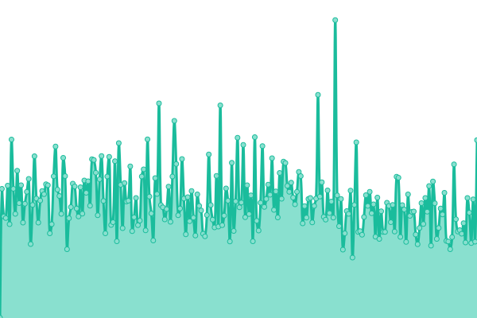
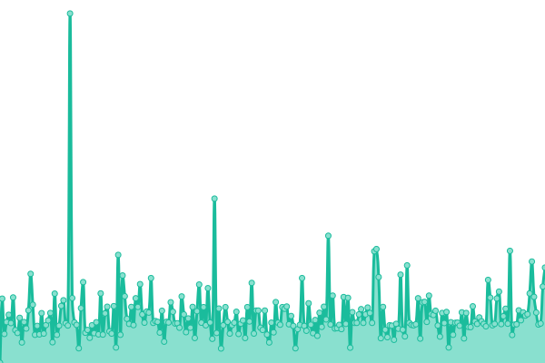

# [📈 Live Status](https://vavab.github.io/API-monitoring): <!--live status--> **🟩 All systems operational**

This repository contains the open-source uptime monitor and status page for [vavab](https://vavab.github.io/API-monitoring), powered by [Upptime](https://github.com/upptime/upptime).

With [Upptime](https://upptime.js.org), you can get your own unlimited and free uptime monitor and status page, powered entirely by a GitHub repository. We use [Issues](https://github.com/vavab/API-monitoring/issues) as incident reports, [Actions](https://github.com/vavab/API-monitoring/actions) as uptime monitors, and [Pages](https://vavab.github.io/API-monitoring) for the status page.

<!--start: status pages-->
<!-- This summary is generated by Upptime (https://github.com/upptime/upptime) -->
<!-- Do not edit this manually, your changes will be overwritten -->
<!-- prettier-ignore -->
| URL | Status | History | Response Time | Uptime |
| --- | ------ | ------- | ------------- | ------ |
|  [API Vélib' disponibles](https://opendata.paris.fr/api/v2/catalog/datasets/velib-disponibilite-en-temps-reel/records?limit=10&offset=0&timezone=UTC) | 🟩 Up | [api-velib-disponibles.yml](https://github.com/vavab/API-monitoring/commits/HEAD/history/api-velib-disponibles.yml) | 

 498ms
     
 | 

<a href="https://vavab.github.io/API-monitoring/history/api-velib-disponibles">100.00%</a>
    

|  [API Chantiers en cours](https://opendata.paris.fr/api/v2/catalog/datasets/chantiers-a-paris/records?limit=10&offset=0&timezone=UTC) | 🟩 Up | [api-chantiers-en-cours.yml](https://github.com/vavab/API-monitoring/commits/HEAD/history/api-chantiers-en-cours.yml) | 

 188ms
     
 | 

<a href="https://vavab.github.io/API-monitoring/history/api-chantiers-en-cours">100.00%</a>
    

<!--end: status pages-->

[**Visit our status website →**](https://vavab.github.io/API-monitoring)

## 📄 License

- Powered by: [Upptime](https://github.com/upptime/upptime)
- Code: [MIT](./LICENSE) © [vavab](https://vavab.github.io/API-monitoring)
- Data in the `./history` directory: [Open Database License](https://opendatacommons.org/licenses/odbl/1-0/)
